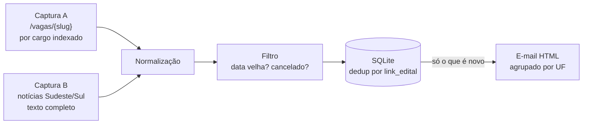

# Concurso Licitação SP

Monitor automático de concursos públicos para a área de **licitação/compras** (pregoeiro, agente de contratação, analista de licitações etc.) em **SP, MG e PR**. Roda sozinho todo dia às 7h via GitHub Actions: captura, filtra, deduplica e manda um resumo por e-mail só com o que é novo.

[](https://github.com/brunogitti/concurso-licitacao-sp/actions/workflows/monitorar.yml)


## Por que existe

Editais para esses cargos ficam espalhados entre centenas de prefeituras e câmaras municipais, sem um lugar único que agregue por cargo. Acompanhar isso manualmente significa visitar o mesmo site todo dia só para ver "o que é novo desde ontem". Este projeto automatiza exatamente essa parte chata: captura, aplica um filtro de sanidade (evita alertar concurso de 2011 ou já cancelado) e entrega um e-mail curto, agrupado por estado.

## Como funciona



O pipeline roda em camadas isoladas — cada módulo só faz uma coisa e não conhece os detalhes dos outros:

| Módulo | Responsabilidade |
|---|---|
| [`capture_pciconcursos.py`](capture_pciconcursos.py) | Scraping das páginas `/vagas/{slug}` do PCI Concursos — uma por cargo monitorado (config em `keywords.yaml`) |
| [`capture_noticias.py`](capture_noticias.py) | Varre notícias regionais buscando cargos de licitação citados em editais "Vários Cargos" que não aparecem indexados por slug (ver seção abaixo) |
| [`normalize.py`](normalize.py) | Traduz o HTML bruto de qualquer uma das duas fontes para um schema único |
| [`filtro.py`](filtro.py) | Descarta concurso com notícia velha (> 90 dias) ou texto indicando cancelamento |
| [`banco.py`](banco.py) | Persistência em SQLite; deduplica por `link_edital` (não existe um ID oficial único na fonte) |
| [`enviar_resumo.py`](enviar_resumo.py) | Monta o HTML do resumo e envia via Gmail SMTP |
| [`main.py`](main.py) | Orquestra tudo; é o que o GitHub Actions chama todo dia |

### Duas fontes de captura, não uma

A primeira versão só lia `/vagas/{slug}` — a página que o PCI Concursos mantém por cargo. Só que editais do tipo "Vários Cargos" (uma prefeitura abrindo 20 vagas diferentes de uma vez) nem sempre têm cada cargo indexado individualmente: casos reais como Meridiano, Potirendaba e Passos citavam "Agente de Contratação" ou "Assistente de Licitação" no meio de uma lista de 10 a 30 cargos e não apareciam em nenhum slug monitorado.

A solução foi uma segunda fonte (`capture_noticias.py`) que varre o texto completo das notícias das regiões Sudeste e Sul procurando as frases exatas dos cargos (`keywords.yaml` → `termos_busca_texto`), independente de indexação. Para não gastar centenas de requisições reprocessando o histórico inteiro a cada execução, essa fonte só busca o texto completo de notícias cujo link **ainda não existe no banco** — uma exceção deliberada à regra geral do projeto de "captura não sabe de banco".

### Persistência sem banco externo

O runner do GitHub Actions é efêmero — nada escrito em disco sobrevive entre execuções. Em vez de contratar um banco gerenciado para um projeto pessoal, o workflow restaura o `concursos.db` de uma branch `data` no início da execução e faz `git push --force` do banco atualizado para essa mesma branch no final. Simples, sem custo, sem serviço externo.

### Bootstrap

Rodar a captura pela primeira vez traria anos de concursos antigos (`/vagas/comprador`, por exemplo, tem histórico até 2008) como se fossem "novidade". Por isso existe `python main.py --bootstrap`: roda a captura completa e grava tudo já marcado como alertado, sem enviar e-mail. É um passo manual, único, antes de ligar o cron de verdade.

## Rodando localmente

```bash
git clone https://github.com/brunogitti/concurso-licitacao-sp.git
cd concurso-licitacao-sp
python -m venv venv
venv\Scripts\activate        # Windows
pip install -r requirements.txt

cp .env.example .env         # preencher GMAIL_USER e GMAIL_APP_PASSWORD
                              # (senha de app do Google, não a senha normal)

python main.py --bootstrap                          # ponto zero, sem e-mail
python main.py --enviar-email seuemail@exemplo.com   # fluxo normal do dia
python main.py --forcar-teste --enviar-email seuemail@exemplo.com  # preview
```

`--forcar-teste` ignora o estado de deduplicação e reenvia um resumo com tudo que já está no banco — útil para conferir como o e-mail fica sem "gastar" o dedup real.

## Testes

```bash
python -m pytest tests/ -q
# 60 passed
```

Cobertura por módulo (captura, normalização, filtro, banco, envio de e-mail), incluindo fixtures HTML reais capturadas da fonte (`tests/fixtures/`) para os casos que motivaram `capture_noticias.py`.

## Configuração (`keywords.yaml`)

Cargos e estados monitorados vivem em [`keywords.yaml`](keywords.yaml), não no código — adicionar um cargo novo ou um estado novo não exige tocar em Python:

- `slugs_cargo`: slugs de `/vagas/{slug}` já normalizados pela própria fonte (sem risco de falso positivo por termo livre)
- `estados_monitorados`: UFs que entram na captura (hoje SP, MG, PR)
- `termos_busca_texto`: frases exatas usadas na varredura de texto completo (`capture_noticias.py`)

## Automação (GitHub Actions)

[`monitorar.yml`](.github/workflows/monitorar.yml) roda todo dia às 7h (horário de Brasília) e também pode ser disparado manualmente (`workflow_dispatch`). Credenciais (`GMAIL_USER`, `GMAIL_APP_PASSWORD`, `EMAIL_DESTINATARIO`) ficam em GitHub Secrets, nunca no repositório.

## Stack

Python 3.12 · requests · BeautifulSoup4 + lxml · PyYAML · python-dotenv · SQLite · pytest · GitHub Actions

## Limitações conhecidas

- Scraping é frágil por natureza: se o PCI Concursos mudar a estrutura do HTML, o parser quebra (cada slug/notícia é tratado isoladamente para que uma falha não derrube a captura inteira).
- [`capture_api.py`](capture_api.py) é uma terceira fonte planejada (API não oficial de concursos de SP) ainda não implementada — fica como próximo passo.
- Sem SLA de nenhuma das fontes; o projeto assume falha parcial como normal e loga em vez de derrubar o processo.

## Licença

[MIT](LICENSE)
